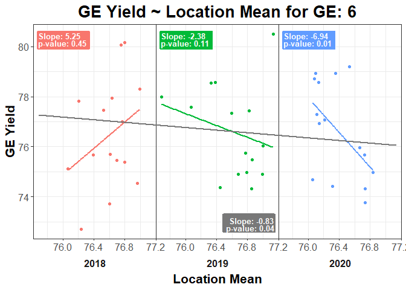

<!-- README.md is generated from README.Rmd. Please edit that file -->

# Finlay-Wilkinson Test

<!-- badges: start -->

<!-- badges: end -->

This package contains the function fw\_test, which runs a
Finlay-Wilkinson test to test for GxE. It does this by testing the
regression coefficient of (GE \~ Location mean) line against a
coefficient of 1.

## Installation

You can install FW like so:

``` r
devtools::install_github("nad7wf/FW")
```

## Example

``` r
library(tidyverse)
library(FW)

set.seed(1)

ge <- matrix(rnorm(405, c(75, 78)), nrow = 27, ncol = 15) %>%
    as.data.frame() %>%
    stats::setNames(paste0("Loc", seq(1, 15))) %>%
    dplyr::mutate(GE = rep(1:9, each = 3),
                  Year = rep(2018:2020, times = 9)) %>%
    dplyr::select(GE, Year, everything())

loc <- plyr::ddply(ge, "Year", function (Year_group) {
    purrr::map_dfr(Year_group[, 3:ncol(Year_group)], mean)
}) %>%
    tidyr::gather(key = "Loc", value = "Loc_mean", -Year) %>%
    dplyr::select(Loc, Year, Loc_mean)

results <- fw_test(ge, loc, 6)
```


