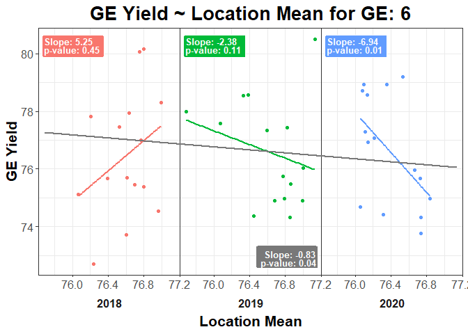

<!-- README.md is generated from README.Rmd. Please edit that file -->

# Finlay-Wilkinson Test

<!-- badges: start -->

<!-- badges: end -->

This package contains the function fw\_test, which runs a
Finlay-Wilkinson test to test for GxE. It does this by testing the
regression coefficient of (GE \~ Location mean) line against a
coefficient of 1.

## Installation

You can install FW like so:

``` r
devtools::install_github("nad7wf/FW")
```

## Example

``` r
library(tidyverse)
#> -- Attaching packages ------------------------------------------------------------------------------------------------ tidyverse 1.3.0 --
#> v ggplot2 3.3.2     v purrr   0.3.4
#> v tibble  3.0.3     v dplyr   1.0.2
#> v tidyr   1.1.2     v stringr 1.4.0
#> v readr   1.3.1     v forcats 0.5.0
#> -- Conflicts --------------------------------------------------------------------------------------------------- tidyverse_conflicts() --
#> x dplyr::filter() masks stats::filter()
#> x dplyr::lag()    masks stats::lag()
library(FW)

set.seed(1)

ge <- matrix(rnorm(405, c(75, 78)), nrow = 27, ncol = 15) %>%
    tibble::as_tibble() %>%
    stats::setNames(paste0("Loc", seq(1, 15))) %>%
    dplyr::mutate(GE = rep(1:9, each = 3),
                  Year = rep(2018:2020, times = 9)) %>%
    dplyr::select(GE, Year, everything())
#> Warning: The `x` argument of `as_tibble.matrix()` must have unique column names if `.name_repair` is omitted as of tibble 2.0.0.
#> Using compatibility `.name_repair`.
#> This warning is displayed once every 8 hours.
#> Call `lifecycle::last_warnings()` to see where this warning was generated.

loc <- plyr::ddply(ge, "Year", function (Year_group) {
    purrr::map_dfr(Year_group[, 3:ncol(Year_group)], mean)
}) %>%
    tidyr::gather(key = "Loc", value = "Loc_mean", -Year) %>%
    dplyr::select(Loc, Year, Loc_mean)

results <- fw_test(ge, loc, 6)
```


You can plot the saved gtable using the *grid* package:


